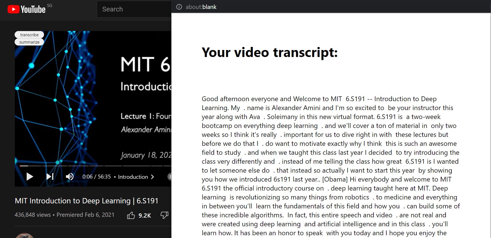
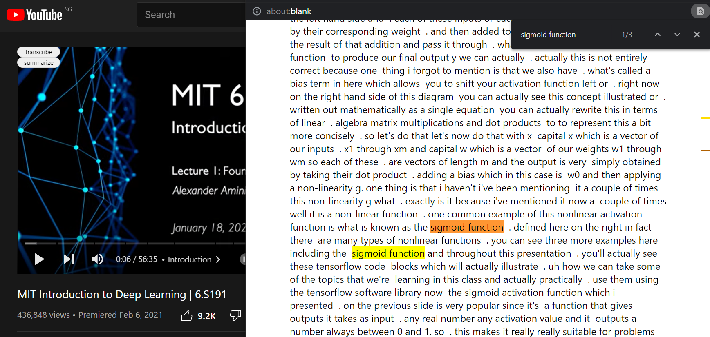
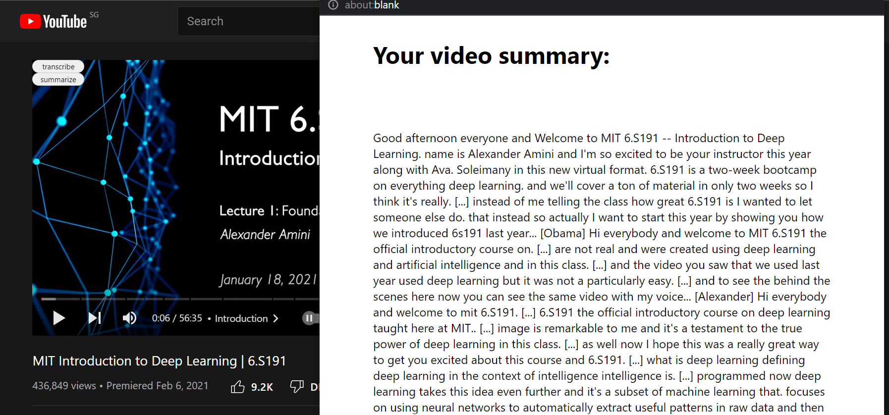

<p align="center">
  
</p>
<h1 align="center">
  Flow
</h1>
<p align="center">
  Make learning from YouTube faster & easier ⚡️
</p>

## 📖 Overview

We're always watching YouTube videos to supplement our learning. We can very often find high quality educational content. The only problem - Our time!

We have such limited time that revisiting a 2 hour video to find a certain important information is not efficient especially during crunch time. Moreover, the video is soo long that we must write our own summary/pointers to grasp the knowledge better. This is also time-consuming.

This is where Flow comes in! Flow is your handy chrome extension to speed up & simply your learning from YouTube videos. Every YouTube video will have 2 buttons - `Transcribe` & `Summarize`.


### Transcribe

Clicking on the `Transcribe` button will produce a full transcript of the video. You can then search for an important pointer from this transcription.




### Summarize

Clicking on the `Summarize` button will produce a shorter textual version of what was said in the video. Before a quiz/test, this is what you want to be reading! Parts indicated with `[...]` are parts where the algorithm thinks is redundant and thus omitted. You can still view the content by visiting these parts in the full transcript.



## 🔎 How it works

Retrieving the transcript from a YouTube video is actually not that simple since the YouTube api only allows you to get the transcription for videos where you are the owner. However, everytime a user clicks on a video, the transcript is sent to the client to enable "closed captions". Flow makes use of these through some nifty JavaScript and collects the the full transcript of the video.

This textual data is then sent to the [Meaning Cloud Text Summarization API](https://learn.meaningcloud.com/developer/summarization/1.0/console) to get the summary. The API performs extractive summarization where only sentences that provide the most info are kept. Each sentence is analyzed given a score based on the TextTeaser & TextRank algorithms. The sentences with the higher score are kept.

This summary is returned and is shown to the client in a new window for them to copy to their personal notes.

> The TextTeaser & TextRank algorithms calculate the scores based on the relative position of the sentence in the text, titles and section headers, presence of words in italics and bold, numbers, and/or some special keywords/phrases.

## 🚀 Getting Started

### 📋 Prerequisites

All you need is the chrome web browser!

### ⚡️ Installing 🔧

Download the project using either:

```
git clone https://github.com/mohamedirfansh/Flow.git
```

Or clicking this [link](https://github.com/mohamedirfansh/Flow/archive/refs/heads/master.zip)

Go to `chrome://extensions/` in your browser and enable "Developer mode". Then, click "Load unpacked" and open the folder of this project. Enable the extension and head over to [YouTube](https://www.youtube.com/) to summarize your video!

---

> This project was built during the Hack&Roll 2022 Hackathon. View the Devpost submission [here](https://devpost.com/software/flow-0x8nq2)
